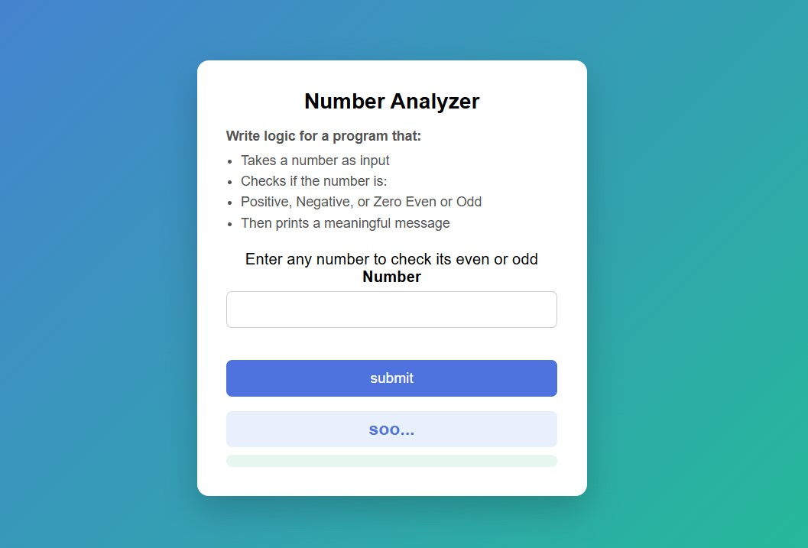
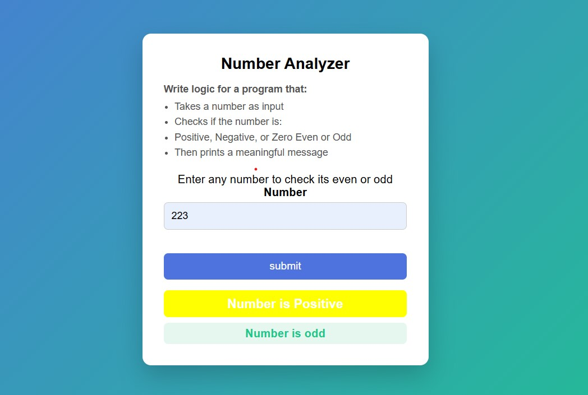

# Number Analyzer
# Number Analyzer

A simple web project using **HTML, CSS, and JavaScript** to analyze numbers and provide meaningful feedback.

---

## Program Description

This program allows the user to:

- Take a number as input
- Check if the number is:
  - **Positive, Negative, or Zero**
  - **Even or Odd**
- Display a meaningful message based on the analysis

---

## Screenshots

### Before analyzing a number

### After analyzing a number

---

## How to Use

1. Open `index.html` in your browser
2. Enter a number in the input field
3. Click **Analyze**
4. See the result displayed below the button

---

## Built With

- **HTML** – Structure of the page  
- **CSS** – Styling and layout  
- **JavaScript** – Logic for analyzing numbers

---